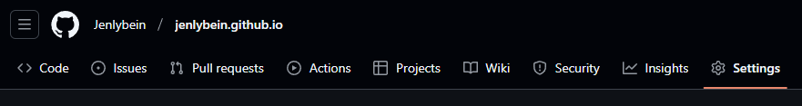
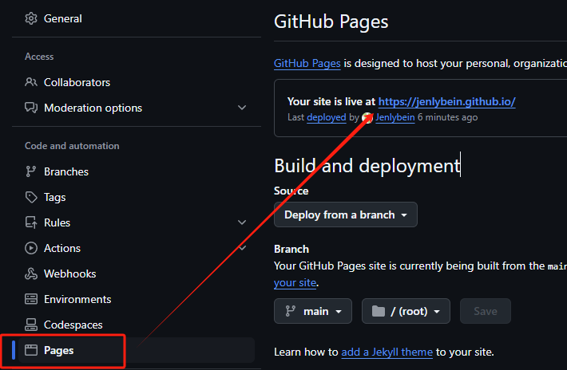
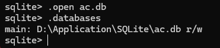
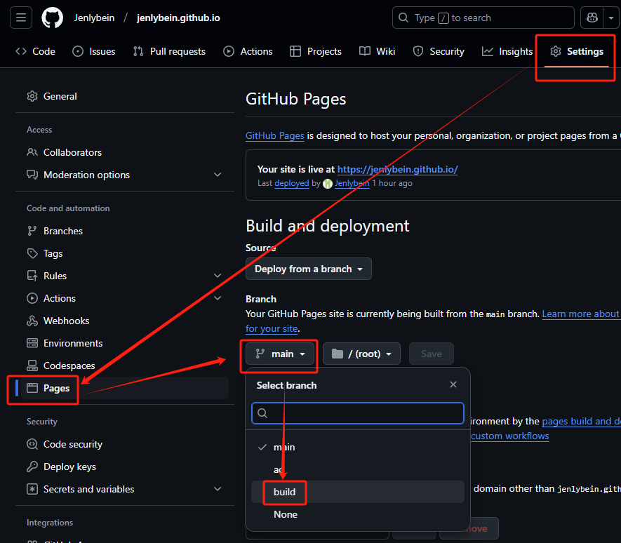

# 基于GitHub Pages构建数据库驱动的博客系统

你是否想过有一个个人博客网站？现在，利用 Github Pages 即可在 Github 免费搭建你的网站。

搜索发现，网上大部分教程已经过时。观看 Github 官方文档： [创建 GitHub Pages 站点 - GitHub 文档](https://docs.github.com/zh/pages/getting-started-with-github-pages/creating-a-github-pages-site) ，发现文档也有些部分是过时的。

研究发现，目前搭建站点变得更方便。

搭建好站点之后，我们可以思考如何制作一个数据库放在 Github ，让网站实现数据库的读取。如使用轻型本地数据库 SQLite。

之后，站点内如何实现博客的渲染，数据库的读取，也是需要注意的。

目前，我已经实现了我的博客站点布置，**欢迎访问**：[个人博客网站 (jenlybein.github.io)](https://jenlybein.github.io/#/) 。

**项目仓库**：[Jenlybein-s-Personal-Github-Blog-Site](https://github.com/Jenlybein/Jenlybein-s-Personal-Github-Blog-Site)

## 一、GitHub Pages站点搭建

### 1. 仓库创建规范

进入 Github 页面，新建个人仓库。

- **命名要求**：采用 `<username>.github.io`格式（如：jenlybein.github.io）

  - 当然，也可以按你的想法来起名字。不过这样做会导致站点访问地址变为 `<username>.github.io/你的仓库名/`格式
- **仓库属性**：设置为公开（Public）仓库

  - 必须是公开仓库，否则无法供他人观看。当然，如果只是自己使用的话，也可以设置为私人。

### 2. 页面部署流程

1. 在本地新建文件夹，进入 bash 初始化仓库。

   ```bash
   git init
   git add .
   git commit -m "init project"
   git branch -M main
   git remote add origin https://github.com/<username>/<username>.github.io.git
   git push -u origin main
   ```
2. 在仓库上传一个 `index.html`，以便测试站点的访问。html 文件内可随意写点东西。
3. 进入仓库页面，点击上栏中 Settings ，进入设置菜单。

   
4. 下拉，找到左栏 Pages 部分，点击进入，可以看到你的网页已经运行在此处。

   
5. 打开该网页，即可看到你刚刚上传的 html。

## 二、数据库解决方案设计

搭建好站点之后，我们可以思考如何制作一个数据库放在 Github ，让网站实现数据库的读取。如使用轻型本地数据库 SQLite。

### 1. 数据存储方案对比

博客的数据可以以多种方式上传：

- 将博客发布在 issues ，图片上传在另一个仓库或者本仓库的另一个分支。之后由 Github 官方的 Api 提供的 issues 读取功能调用博客，且 issues 下的评论也可显示到博客中。

  Issues 功能官方文档：[适用于问题的 REST API 终结点 - GitHub 文档](https://docs.github.com/zh/rest/issues?apiVersion=2022-11-28)

  参考：[把Github当作数据库 - 掘金 (juejin.cn)](https://juejin.cn/post/6948751707107131405)
- 博客放在另一个仓库，直接通过 `raw.githubusercontent.com`获取文件内容。然后，使用本仓库的另一个分支存储博客的信息数据，那么更新的时候只需要修改该分支的数据存储文件即可。

因为我之前已经有将部分笔记文件上传到我的一个 Github 仓库内，所以此处我使用的是第二种方法。

按此方法，我使用 **SQLite** 来存储所需的数据文件。（当然，**IndexDB** 也是可以的！）

首先，我们本地创建一个 SQLite 文件，然后将其上传到仓库内的另一个分支。这样可方便数据库版本管理。

### 2. SQLite 安装使用

SQLite是一个软件库，实现了自给自足的、无服务器的、零配置的、事务性的 SQL 数据库引擎。

- 官方下载网址 ： [SQLite Download Page](https://www.sqlite.org/download.html) 。
- 下载 **sqlite-tools-win-\*.zip** 和 **sqlite-dll-win-\*.zip** 压缩文件。
- 寻找合适的位置创建文件夹 `.../SQLite` 在此文件夹下解压上面两个压缩文件，将得到 sqlite3.def、sqlite3.dll 和 sqlite3.exe 文件。
- 添加你所解压路径 `.../SQLite` 到 PATH 环境变量，最后在命令提示符下，使用 **sqlite3** 命令，将显示如下结果。

  ```bash
  SQLite version 3.49.1 2025-02-18 13:38:58
  Enter ".help" for usage hints.
  Connected to a transient in-memory database.
  Use ".open FILENAME" to reopen on a persistent database.
  sqlite>
  ```

相关操作请查看第三方教程，如：[SQLite 简介 | 菜鸟教程 (runoob.com)](https://www.runoob.com/sqlite/sqlite-intro.html) 。

### 3. SQLite数据库实践

安装之后创建数据库，并上传到 Github 了。

当然，网页无法对传入到 Github 的数据库直接进行修改。

若想实现修改的话，也可以利用仓库管理 Token。但是因为 Token 无法有任何有效手段保护，直接暴露在前端源代码，任何人都可以轻松获取到该 Token，导致个人仓库内容不安全。

所以，后期我们可以考虑在网页内创建一个数据库管理工具。

- 创建新的数据库 `ac.db` 。 `.open`执行后会在命令执行路径下生成对应文件。

  ```sql
  sqlite3
  sqlite> .open ac.db
  ```
- 查看是否打开成功

  ```sql
  sqlite> .databases
  ```

  
- SQLite 的 **CREATE TABLE** 语句用于在任何给定的数据库创建一个新表。

  此处，我简单创建一个关于博客信息的表。

  ```sql
  -- 博客表
  CREATE TABLE blog (
      blog_id INTEGER PRIMARY KEY AUTOINCREMENT,
      blog_name TEXT NOT NULL,
      category_id INTEGER NOT NULL,
      pull_address TEXT NOT NULL,
      FOREIGN KEY (category_id) REFERENCES category(category_id)
  );

  -- 标签表
  CREATE TABLE tag (
      tag_id INTEGER PRIMARY KEY AUTOINCREMENT,
      tag_name TEXT NOT NULL UNIQUE
  );

  -- 分类表
  CREATE TABLE category (
      category_id INTEGER PRIMARY KEY AUTOINCREMENT,
      category_name TEXT NOT NULL UNIQUE
  );

  -- 博客与标签的关联表
  CREATE TABLE blog_tag (
      blog_id INTEGER NOT NULL,
      tag_id INTEGER NOT NULL,
      PRIMARY KEY (blog_id, tag_id),
      FOREIGN KEY (blog_id) REFERENCES blog(blog_id),
      FOREIGN KEY (tag_id) REFERENCES tag(tag_id)
  );
  ```
- 接着，插入数据。比如，我之前上传的 Vue 学习笔记。

  ```sql
  INSERT INTO blog (blog_name, category_id, pull_address)
  VALUES
    ('Vue 基础', 1, '开发/前端相关/Vue笔记/1.Vue基础.md'),
    ('Vue Route 路由', 1, '开发/前端相关/Vue笔记/2.VueRoute路由.md'),
    ('Vue Pinia 状态管理', 1, '开发/前端相关/Vue笔记/1.Vue基础.md'),
    ('Vue 基础进阶', 1, '开发/前端相关/Vue笔记/1.Vue基础.md');

  INSERT INTO category (category_name)
  VALUES
    ('Vue 详细学习笔记');

  INSERT INTO tag (tag_name)
  VALUES
    ('Vue');

  INSERT INTO blog_tag (blog_id, tag_id)
  VALUES
    (1,1),
    (2,1),
    (3,1),
    (4,1);
  ```
- 多表联查，查看我们插入的信息。

  ```sql
  SELECT 
    blog.blog_id,
    blog.blog_name,
    category.category_name,
    GROUP_CONCAT(tag.tag_name) AS tags,
    blog.pull_address
  FROM blog
  JOIN category ON blog.category_id = category.category_id
  LEFT JOIN blog_tag ON blog.blog_id = blog_tag.blog_id
  LEFT JOIN tag ON blog_tag.tag_id = tag.tag_id;
  ```
- 检查无误后，新建一个文件夹，将该数据文件 `ac.db` 放入。按以下操作，将 ac.db 上传到 Github 的 ac 分支（ac 是 Article Data 的简写）。

  ```bash
  # 创建一个叫 ac 的分支并进入，同上上传分支内容。
  git clone 你的仓库地址 # 之后删除拉取的文件，除了 .git 文件夹。
  git checkout -b ac
  git add .
  git commit -m "ac init"
  git push origin ac
  ```

## 三、打包与设置

如果你已经做好了博客网站，可以直接打包上传。

此处我制作的前端项目的是使用 Vue3 - Vite 技术栈。

- 对博客网页项目制作好后，进行打包

  ```bash
  # vite 打包
  npm run build
  ```
- 打包好的内容将会出现在项目根目录内的 dist 文件夹。
- 将 dist 文件夹的内容拉出，放入新建的文件夹，上传放入本仓库的新分支。

  ```bash
  # 创建一个叫 build 的分支并进入，同上上传分支内容。
  git clone 你的仓库地址 # 之后删除拉取的文件，除了 .git 文件夹。
  git checkout -b build
  git add .
  git commit -m "build init"
  git push origin build
  ```
- 将上传的分支作为页面展示内容

  

## 四、前端集成方案

### 1. 技术选型

- **基础框架**：Vue 3 + Vite
- **数据库驱动**：sql.js（WebAssembly版本SQLite）
- **UI组件库**：Element Plus
- **路由管理**：Vue Router 4
- **状态管理**：Pinia

### 2. sql.js 的导入与使用

对于网页端的 sqlite 使用，可以使用 `sql.js` 库。

`sql.js` 是 SQLite 的 Webassembly 版，使用上和 SQLite 基本没有区别。

`sql.js` 的官方文档：[Inside the browser (sql.js.org)](https://sql.js.org/#/?id=inside-the-browser)

由于 sql.js 使用 Webassembly 技术，所以导入的时候需要做多一些操作。

- 项目内下载 `sql.js` 库。

  ```bash
  npm i sql.js
  ```
- sql.js需要依赖 sql-wasm.wasm 文件，我们需要添加到自己的目录下面引用（直接使用会导致某些bug错误发生）。

  - 进入到 `/node_modules/sql.js/dist/`文件夹内，将其中的 sql-wasm.wasm 文件提取出，放到根目录下的 `/public`。
  - 然后，使用时需要手动引用文件。

    ```js
    const SQL = await initSqlJs({
        // 这里会加载dist/sql-wasm.wasm
        locateFile: file => `./${file}`
    });
    ```
  - 以下是示例 vue  `sql.js` 库使用的文件。

    ```vue
    <template>
      <div></div>
    </template>

    <script setup lang="ts">
    import initSqlJs from 'sql.js';

    import { onMounted, ref } from 'vue';

    const blogData = ref<any>(null)

    onMounted(async () => {
      const SQL = await initSqlJs({
        // 这里会加载dist/sql-wasm.wasm
        locateFile: file => `./node_modules/sql.js/dist/${file}`
      });

      const dbFile = await fetch("https://raw.githubusercontent.com/Jenlybein/jenlybein.github.io/ac/ac.db")
        .then(res => res.arrayBuffer());

      const db = new SQL.Database(new Uint8Array(dbFile));

      const result = db.exec('SELECT * FROM blog');
      blogData.value = result[0]?.values || [];
      console.log(blogData.value)
    });
    </script>
    ```

具体的使用，可以将其封装为一个 hook ：查看我项目仓库中 `src\utils\sqliteUtils.ts` 。

### 3. Markdown渲染方案

我是使用 markdown 上传的博客，所以 Markdown 渲染很重要。

在项目中，我使用的是 `Markdown-it` 库，配合 `plugin-figure`插件渲染图片说明，`markdown-it-texmath`渲染公式。

- 在使用时，我发现部分笔记文件的图片地址使用的是相对地址。于是我需要使用正则表达式将相对地址改为正确的绝对地址，读取存储在 github 的图片。
  - 图片地址有两种，所以要做两种匹配：一种是 `` 的 html 形态，另一种是 ``的形式。
  - 修改地址，如 `./assets/123.png` 改为 `https://raw.githubusercontent.com/Jenlybein/对应仓库/分支/正确路径/123.png`
  - 详细可看项目内 ：`src\pages\Article\Article.vue` 注释位置（markdown图片地址转化）
- 使用时，发现后渲染的文本使用 `v-html`展示时，无法直接使用当页导入的 `scoped css`，所以需要导入一个全局的 css。
  - 直接使用全局 css 会导致样式污染，所以可以在转化 markdown 为 html 时添加规则，在每个被渲染的条目上加上 class 为 `.markdown`，这样就可以方便 css 文件内精准选中需要渲染的内容。
- 公式渲染时，一些公式会出现无法渲染，或渲染出错。
  - 观察发现，一些 `$$` 包裹的多行公式跨越多行，导致 markdown 转为 html 时被分为多个 `<p>` 公式渲染检测失败。一些 `$` 包裹单行公式的内容前后含有空格，这样也会导致渲染失败。
  - 使用正则表达式去掉单行公式前后的内容，且把多行公式的内容转化为单行。
- 将 markdown 渲染功能封装为 hook 更方便复用 ：`src\utils\mditUtils.ts`

观察渲染效果，发现渲染十分成功。


## 四、功能扩展

### 1. 视觉优化方案

在项目中，尽量添加动效来增加视觉动感，让访问者体验更好。

如：

- 顶栏中添加一个滑动方块。
- 顶栏切换页面后，标题栏的大小会改变，这时候可以编写 js 函数使其高度变化平滑，而不是突然变化。
- 信息卡的加载使用从上到下滑动出现，增加视觉效果。

### 2. 性能优化策略

1. **缓存机制**：下载的数据库文件可以存放在本地的 `LoaclStorage`，避免频繁下载。

   hook 位置：`src\utils\tokenUtils.ts`。

### 3. 操作优化策略

文章阅读时候，在侧栏中加入一个跳转的卡片，方便跳转。


增加搜索功能，更方便的找到文章。


增加分类页和标签页，更快看到所有的文章的集合。
